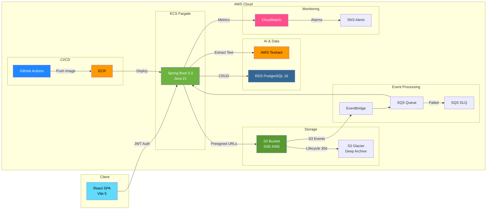

<h1 align="center">DocPipeline 🔐📄</h1>

<p align="center">
  <strong>Cloud-Native Secure Document Processing & Analytics Pipeline</strong>
</p>

<p align="center">
  
  
  
  
  
  
</p>

---

A **production-grade SaaS platform** for secure enterprise document processing. Upload PDFs, CSVs, and images — they're encrypted with **AWS KMS**, processed via **AWS Textract** for intelligent text extraction, and automatically archived to **S3 Glacier Deep Archive** for cost-optimized long-term retention.

---

## 🏗️ Architecture



---

## 🛠️ Tech Stack

| Layer | Technology |
|---|---|
| **Backend** | Spring Boot 3.3 · Java 21 · Spring Security (JWT) · Flyway |
| **Frontend** | React 18 · Vite 5 · Vanilla CSS (Glassmorphism dark theme) |
| **Database** | PostgreSQL 16 · Flyway Migrations |
| **Cloud Services** | AWS S3 · KMS · EventBridge · Textract · SQS · ECS Fargate |
| **Infrastructure** | Terraform (modular: VPC, RDS, ECS, S3, KMS, EventBridge, Monitoring) |
| **CI/CD** | GitHub Actions → Amazon ECR → ECS Fargate (blue/green) |
| **Monitoring** | Micrometer → CloudWatch Metrics · SNS Alarm Notifications |
| **Containerization** | Docker multi-stage builds · Docker Compose (local dev) |

---

## ✨ Features

| Category | Feature |
|---|---|
| 🔑 **Auth** | JWT-based stateless authentication & role-based authorization |
| 📤 **Upload** | Presigned URL uploads — zero backend bandwidth consumption |
| 🔐 **Encryption** | S3 SSE-KMS with customer-managed keys |
| ⚡ **Event-Driven** | S3 → EventBridge → SQS → Spring Boot listener → Textract |
| 📊 **AI Extraction** | Async document text & metadata extraction via AWS Textract |
| 📋 **Reports** | Downloadable analysis reports with extracted content |
| 🧊 **Archival** | S3 Lifecycle transitions to Glacier Deep Archive after 30 days |
| 📈 **Observability** | CloudWatch custom metrics, alarms, and SNS email alerts |
| 🏗️ **IaC** | Fully reproducible infrastructure via Terraform modules |
| 🚀 **CI/CD** | Automated test → build → deploy pipeline via GitHub Actions |
| 🐳 **Containers** | Multi-stage Docker builds for minimal production images |
| 🎨 **UI** | Premium React SPA with glassmorphism dark theme |

---

## 🚀 Quick Start

### Prerequisites

| Tool | Version |
|---|---|
| Java (Temurin) | 21+ |
| Maven | 3.9+ |
| Node.js | 20+ |
| Docker & Docker Compose | Latest |
| AWS CLI | v2 (or use LocalStack for local dev) |
| Terraform | 1.8+ |

### Local Development

```bash
# 1. Clone the repository
git clone https://github.com/your-org/docpipeline.git
cd docpipeline

# 2. Start local infrastructure (PostgreSQL, LocalStack)
docker-compose up -d

# 3. Run the Spring Boot backend
mvn spring-boot:run

# 4. Run the React frontend (in a new terminal)
cd frontend
npm install
npm run dev
```

Open **http://localhost:5173** in your browser.

### Deploy Infrastructure to AWS

```bash
cd infra

# Copy and configure variables
cp terraform.tfvars.example terraform.tfvars
# Edit terraform.tfvars with your AWS account details, VPC CIDR, etc.

# Initialize, plan, and apply
terraform init
terraform plan
terraform apply
```

### Deploy Application via CI/CD

Push to `main` to trigger the full pipeline:

```bash
git push origin main
```

The GitHub Actions workflow will:
1. ✅ Run all tests (`mvn verify`)
2. 📦 Build the JAR (`mvn package`)
3. 🐳 Build & push Docker image to ECR
4. 🚀 Deploy to ECS Fargate with rolling update

---

## 📡 API Endpoints

> **Swagger UI:** [http://localhost:8080/swagger-ui.html](http://localhost:8080/swagger-ui.html)

### Authentication

| Method | Endpoint | Description |
|---|---|---|
| `POST` | `/api/auth/register` | Register a new user |
| `POST` | `/api/auth/login` | Login and receive JWT token |

### Documents

| Method | Endpoint | Description |
|---|---|---|
| `POST` | `/api/documents/presigned-url` | Generate S3 presigned upload URL |
| `POST` | `/api/documents/{id}/confirm-upload` | Confirm upload completion |
| `GET` | `/api/documents` | List all user documents |
| `GET` | `/api/documents/{id}` | Get document details & status |
| `GET` | `/api/documents/{id}/download-url` | Generate presigned download URL |

### Reports

| Method | Endpoint | Description |
|---|---|---|
| `POST` | `/api/reports/{id}/generate` | Trigger report generation |
| `GET` | `/api/reports/{id}` | Get report details |

---

## 📁 Project Structure

```
docpipeline/
├── .github/
│   └── workflows/
│       ├── deploy.yml              # CI/CD: test → build → ECR → ECS
│       └── terraform.yml           # IaC: plan → apply on infra/ changes
├── frontend/                       # React 18 / Vite 5 SPA
│   ├── src/
│   │   ├── components/             # Reusable UI components
│   │   ├── pages/                  # Route pages
│   │   ├── services/               # API client
│   │   └── App.jsx
│   ├── index.html
│   └── package.json
├── infra/                          # Terraform Infrastructure as Code
│   ├── modules/
│   │   ├── vpc/                    # VPC, subnets, NAT gateway
│   │   ├── rds/                    # PostgreSQL 16 instance
│   │   ├── ecs/                    # Fargate cluster & service
│   │   ├── s3/                     # Encrypted bucket + lifecycle
│   │   ├── kms/                    # Customer-managed KMS key
│   │   ├── eventbridge/            # S3 → EventBridge → SQS rules
│   │   └── monitoring/             # CloudWatch dashboards & alarms
│   ├── main.tf
│   ├── variables.tf
│   ├── outputs.tf
│   └── terraform.tfvars.example
├── src/
│   ├── main/
│   │   ├── java/com/docpipeline/
│   │   │   ├── auth/               # JWT authentication & filters
│   │   │   ├── config/             # AWS SDK, Security, Swagger config
│   │   │   ├── document/           # Document entity, repo, service, controller
│   │   │   ├── processing/         # EventBridge + SQS listener + Textract
│   │   │   ├── report/             # Report generation service
│   │   │   ├── storage/            # S3 operations (presigned URLs, upload)
│   │   │   └── monitoring/         # Custom Micrometer metrics
│   │   └── resources/
│   │       ├── application.yml
│   │       ├── application-dev.yml
│   │       └── db/migration/       # Flyway SQL migrations
│   └── test/                       # Unit & integration tests
├── Dockerfile                      # Multi-stage build
├── docker-compose.yml              # Local dev (Postgres, LocalStack)
├── pom.xml                         # Maven dependencies
├── .gitignore
└── README.md
```

---

## 📊 Monitoring & Observability

### CloudWatch Metrics

| Namespace | Metric | Description |
|---|---|---|
| `DocPipeline` | `document.uploads` | Total documents uploaded |
| `DocPipeline` | `document.processing.duration` | Processing time (p50/p95/p99) |
| `DocPipeline` | `document.processing.success` | Successful extractions |
| `DocPipeline` | `document.processing.failure` | Failed extractions |
| `DocPipeline` | `textract.invocations` | Textract API calls |

### CloudWatch Alarms

| Alarm | Threshold | Action |
|---|---|---|
| CPU Utilization | > 80% for 5 min | SNS → Email |
| Memory Utilization | > 80% for 5 min | SNS → Email |
| 5xx Error Rate | > 5 per minute | SNS → Email |
| DLQ Message Count | > 0 | SNS → Email |

---

## 🔒 Security

- **Authentication:** JWT-based stateless auth with refresh tokens
- **Password Storage:** BCrypt hashing with configurable strength
- **Encryption at Rest:** S3 SSE-KMS with customer-managed CMK
- **Encryption in Transit:** TLS 1.2+ enforced on all endpoints
- **Network Isolation:** ECS tasks and RDS in private subnets
- **Security Groups:** Least-privilege ingress/egress rules
- **S3 Access:** No public access; presigned URLs with expiration
- **CI/CD Auth:** GitHub OIDC → AWS IAM (no long-lived credentials)
- **Secrets:** Managed via AWS Secrets Manager, injected at runtime

---

## 🧪 Testing

```bash
# Run all tests
mvn verify

# Run unit tests only
mvn test

# Run integration tests only
mvn verify -Dskip.unit.tests=true

# Generate coverage report
mvn verify jacoco:report
# Report at: target/site/jacoco/index.html
```

---

## 🤝 Contributing

1. Fork the repository
2. Create a feature branch (`git checkout -b feature/amazing-feature`)
3. Commit your changes (`git commit -m 'feat: add amazing feature'`)
4. Push to the branch (`git push origin feature/amazing-feature`)
5. Open a Pull Request

Please ensure:
- All tests pass (`mvn verify`)
- Code follows existing style conventions
- Terraform changes pass validation (`terraform validate && terraform fmt -check`)

---

## 📄 License

This project is licensed under the **MIT License** — see the [LICENSE](LICENSE) file for details.

---

<p align="center">
  Built with ☕ Java 21 · 🍃 Spring Boot · ⚛️ React · 🏗️ Terraform · ☁️ AWS
</p>
