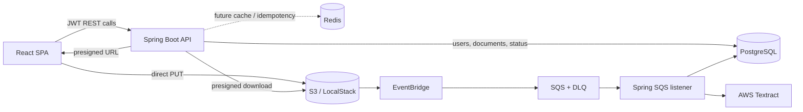

# DocPipeline

DocPipeline is a secure, event-driven document ingestion service that uploads files directly to object storage, extracts structured content with AWS Textract, and exposes results through an authenticated API and React UI.

[](https://github.com/harjasae2001/docpipeline/actions/workflows/ci.yml) [](https://adoptium.net/) [](LICENSE)

> Replace `OWNER/REPOSITORY` in the CI badge after forking the repository.

## What it solves

Teams receiving PDFs and images often have to build secure uploads, identity, durable storage, extraction, status tracking, and reporting before they can use the documents themselves. DocPipeline combines those concerns:

- users upload directly to S3-compatible storage through short-lived presigned URLs;
- the API records ownership and processing state in PostgreSQL;
- EventBridge and SQS decouple uploads from extraction;
- Textract extracts text, forms, and tables asynchronously;
- users inspect results and generate JSON reports without receiving storage credentials.

The application server does not proxy large upload bodies, and every document query is scoped to the authenticated owner.

## Current status

This is a working reference implementation, not a finished compliance product. PostgreSQL, JWT authentication, S3, SQS, Textract, Swagger, Docker, Terraform, and GitHub Actions are implemented. Redis is provided locally, but application caching is not wired yet. Request idempotency and explicit retry/backoff policies are hardening work described below, not completed features.

## Architecture


```mermaid
flowchart LR
    U[React SPA] -->|JWT REST calls| A[Spring Boot API]
    A -->|users, documents, status| P[(PostgreSQL)]
    A -.->|future cache / idempotency| R[(Redis)]
    A -->|presigned URL| U
    U -->|direct PUT| S[(S3 / LocalStack)]
    S --> E[EventBridge]
    E --> Q[SQS + DLQ]
    Q --> W[Spring SQS listener]
    W --> T[AWS Textract]
    W --> P
    A -->|presigned download| S
```

### Data flow

1. The React client registers or signs in and receives a bearer JWT.
2. It requests an upload URL. The API creates a `PENDING_UPLOAD` document and returns a 15-minute S3 presigned URL.
3. The browser uploads directly to S3 and confirms the upload with the API.
4. S3 emits an object-created event through EventBridge to SQS. The listener starts asynchronous Textract analysis.
5. A scheduled worker polls active jobs every 30 seconds and stores text, JSON metadata, timestamps, and final status in PostgreSQL.
6. The client reads document state or asks the API to write and sign a JSON report in S3.

Production Terraform covers VPC, RDS, ECS Fargate, S3/KMS, EventBridge/SQS, frontend hosting, and monitoring. Docker Compose runs PostgreSQL, Redis, and LocalStack locally.

### Trade-offs

- Direct-to-S3 uploads save backend bandwidth but require browser CORS and a two-step upload/confirmation flow.
- SQS provides buffering and a dead-letter queue, but delivery is at least once, so consumers must handle duplicates.
- Textract polling is simple and recoverable, but adds latency and database scans. Event-driven completion scales better.
- PostgreSQL is authoritative; Redis should contain only reproducible cache or short-lived idempotency data.
- The scheduler runs in every API replica. Production should add distributed locking or use a dedicated worker.

## Tech stack

| Area | Technology |
| --- | --- |
| Backend | Java 21, Spring Boot 3.3, Spring MVC, Security, Data JPA |
| Frontend | React 19, Vite 8, Axios |
| Data | PostgreSQL 16, Flyway; Redis 7 local dependency (integration pending) |
| AWS | S3, KMS, EventBridge, SQS/DLQ, Textract, ECS, RDS, CloudWatch |
| API | OpenAPI 3 and Swagger UI via springdoc-openapi |
| Delivery | Docker, Docker Compose, Terraform, GitHub Actions, ECR |
| Quality | JUnit 5, Mockito, Spring Boot Test, Qodana, oxlint |

## Key engineering decisions

### Idempotent request handling

The listener currently accepts only `PENDING_UPLOAD` or `UPLOADED` documents, and upload confirmation sets its timestamp once. This reduces duplicate work but is not safe against every concurrent redelivery.

The intended production design is an `Idempotency-Key` on mutations, atomically reserved as `user + route + key` in Redis with a TTL and replayed response. Durable side effects also need a database uniqueness constraint. Event consumers should use compare-and-set status transitions or a processed-event table. Until implemented, clients should not assume all POST operations are fully idempotent.

### JWT authentication and role-based access

Spring Security is stateless. Auth, Swagger, and public health routes are open; other APIs require a signed bearer JWT. Passwords are BCrypt-hashed, users expose `ROLE_<role>`, and repository queries include the authenticated user ID.

Tokens currently contain the email subject and expire after 24 hours. There is no refresh/revocation flow. Supply a unique 256-bit `JWT_SECRET` outside local development and add route-level role rules before administrative endpoints.

### Retry and backoff for external APIs

SQS supplies coarse retry behavior and locally moves messages to the DLQ after three receives. AWS clients otherwise use SDK defaults; the app has no explicit jitter, timeout budget, or circuit breaker. Production should use bounded exponential backoff with jitter for transient failures, avoid retrying validation/auth failures, emit retry/DLQ metrics, and expire abandoned Textract jobs.

### Caching and invalidation

PostgreSQL remains authoritative. Redis is in Compose so integration can be added without changing local topology, but the app currently performs no caching. A good first cache is document detail keyed by `userId:documentId` with a short TTL; evict after confirmation, processing transitions, report generation, and deletion. Avoid paginated-list caching initially. Never cache presigned URLs beyond their lifetime or cache document data without an owner-scoped key.

## Run locally

### Prerequisites

- Java 21
- Docker Engine with Docker Compose v2
- Node.js 20+ and npm
- Maven 3.9+ (the repository also includes the Unix `mvnw` script)

### 1. Configure

```powershell
Copy-Item .env.example .env
```

On Bash, use `cp .env.example .env`. `.env` is ignored by Git. Never commit real passwords, tokens, AWS keys, or Terraform variable files.

### 2. Start dependencies

```bash
docker compose --env-file .env up -d
docker compose ps
```

PostgreSQL listens on `5432`, Redis on `6379`, and LocalStack on `4566`. The bootstrap creates S3, KMS, SQS/DLQ, and EventBridge resources. LocalStack does not emulate every Textract workflow; full extraction may require AWS.

### 3. Start the API

PowerShell:

```powershell
Get-Content .env | ForEach-Object {
  if ($_ -match '^[^#].*=') {
    $name, $value = $_ -split '=', 2
    Set-Item -Path "Env:$name" -Value $value
  }
}
mvn spring-boot:run "-Dspring-boot.run.profiles=local"
```

Bash:

```bash
set -a
source .env
set +a
./mvnw spring-boot:run -Dspring-boot.run.profiles=local
```

The API listens on <http://localhost:8080>.

### 4. Start the frontend

```bash
cd frontend
npm ci
VITE_API_BASE_URL=http://localhost:8080/api npm run dev
```

PowerShell users can run `$env:VITE_API_BASE_URL = "http://localhost:8080/api"` before `npm run dev`. Open <http://localhost:5173>.

### 5. Create sample data

```bash
curl -X POST http://localhost:8080/api/auth/register \
  -H "Content-Type: application/json" \
  -d '{"email":"demo@example.com","password":"ChangeMe123!","fullName":"Demo User"}'
```

Copy the returned token and request an upload:

```bash
curl -X POST http://localhost:8080/api/documents/presigned-url \
  -H "Authorization: Bearer YOUR_TOKEN" \
  -H "Content-Type: application/json" \
  -d '{"fileName":"sample.pdf","contentType":"application/pdf"}'
```

PUT a file to `uploadUrl`, then call `POST /api/documents/{documentId}/confirm-upload`. Migrations create schema only; there is no default user.

Stop services with `docker compose down`. Use `docker compose down -v` only when intentionally deleting local volumes.

## API documentation

- Swagger UI: <http://localhost:8080/swagger-ui.html>
- OpenAPI JSON: <http://localhost:8080/v3/api-docs>
- Health: <http://localhost:8080/actuator/health>

Main resource groups are `/api/auth`, `/api/documents`, and `/api/reports`. The generated OpenAPI document is the authoritative endpoint catalogue.

## Quality

```bash
mvn verify
cd frontend
npm ci
npm run lint
npm run build
```

The `CI` workflow runs backend test/build and frontend lint/build on pushes and pull requests. Deployment workflows publish to ECR/ECS and S3/CloudFront from `main`; they require AWS OIDC and repository secrets. Qodana supplies static analysis. This repository does not currently guarantee a public deployment URL or coverage threshold.

## Repository layout

```text
frontend/                 React/Vite client
infra/                    Terraform root and AWS modules
scripts/                  LocalStack bootstrap
src/main/java/            Spring Boot application
src/main/resources/       configuration and Flyway migrations
src/test/java/            unit and integration tests
.github/workflows/        CI, quality, Terraform, deployment
docker-compose.yml        PostgreSQL, Redis, LocalStack
Dockerfile                multi-stage backend image
```

## Contributing

Read [CONTRIBUTING.md](CONTRIBUTING.md). Bug and feature templates are under `.github/ISSUE_TEMPLATE`.

## License

Licensed under the [MIT License](LICENSE).
